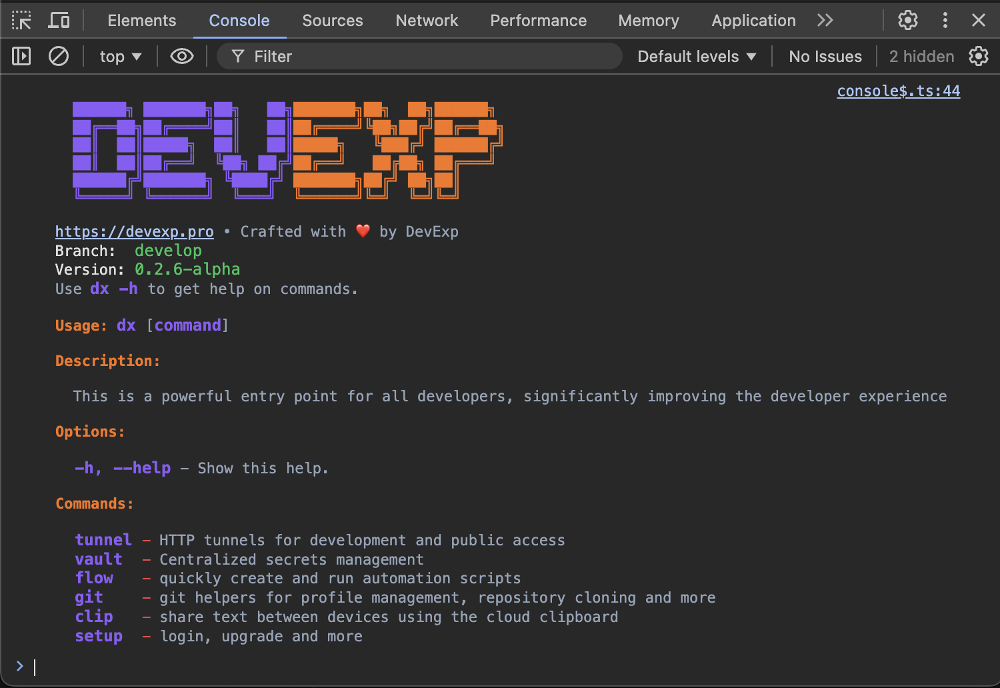

# console-style 🎨

✨ Styled console output for browser with CSS-like styles 💅

## Installation

```bash
npm install console-style
```

## Usage

### Real-world example



```typescript
import { console$, style, _ } from "console-style";

const mono = style({ fontFamily: "monospace", fontSize: "12px" });
const bold = style({ fontWeight: "bold" });
const purple = style({ color: "#8B5CF6" });
const orange = style({ color: "#F97316" });
const gray = style({ color: "#94A3B8" });
const green = style({ color: "#22C55E" });
const red = style({ color: "#EF4444" });

const cmd = _(style({ color: "#8B5CF6" }), bold);
const highlight = _(style({ color: "#F97316" }), bold);

console$(style({})`
  ${purple`  ██████╗ ███████╗██╗   ██╗`}${orange`███████╗██╗  ██╗██████╗ `}
  ${purple`  ██╔══██╗██╔════╝██║   ██║`}${orange`██╔════╝╚██╗██╔╝██╔══██╗`}
  ${purple`  ██║  ██║█████╗  ██║   ██║`}${orange`█████╗   ╚███╔╝ ██████╔╝`}
  ${purple`  ██║  ██║██╔══╝  ╚██╗ ██╔╝`}${orange`██╔══╝   ██╔██╗ ██╔═══╝ `}
  ${purple`  ██████╔╝███████╗ ╚████╔╝ `}${orange`███████╗██╔╝ ██╗██║     `}
  ${purple`  ╚═════╝ ╚══════╝  ╚═══╝  `}${orange`╚══════╝╚═╝  ╚═╝╚═╝     `}
  
  https://devexp.pro ${gray`• Crafted with ❤️ by DevExp`}
  Branch:  ${_(green, mono)`develop`}
  Version: ${_(green, mono)`0.2.6-alpha`}
  ${gray`Use `}${_(cmd, mono)`dx -h`}${gray` to get help on commands.`}

  ${highlight`Usage:`} ${_(cmd, mono)`dx`} ${gray`[`}${_(cmd, mono)`command`}${gray`]`}

  ${highlight`Description:`}

  ${gray`  This is a powerful entry point for all developers, significantly improving the developer experience`}

  ${highlight`Options:`}

  ${_(cmd, mono)`  -h, --help `}${gray`- Show this help.`}

  ${highlight`Commands:`}

  ${_(cmd, mono)`  tunnel `}${red`-`}${gray` HTTP tunnels for development and public access`}
  ${_(cmd, mono)`  vault  `}${red`-`}${gray` Centralized secrets management`}
  ${_(cmd, mono)`  flow   `}${red`-`}${gray` quickly create and run automation scripts`}
  ${_(cmd, mono)`  git    `}${red`-`}${gray` git helpers for profile management, repository cloning and more`}
  ${_(cmd, mono)`  clip   `}${red`-`}${gray` share text between devices using the cloud clipboard`}
  ${_(cmd, mono)`  setup  `}${red`-`}${gray` login, upgrade and more`}
`);
```

### Basic Usage

```javascript
import { console$, style } from "console-style";

// Simple text
console$("Hello World");

// Colored text
console$(style({ color: "red" })`Error message`);

// Combined styles
console$(
  style({
    color: "blue",
    fontWeight: "bold",
    fontSize: "20px",
  })`Styled message`
);
```

### Multiple Styles

```javascript
import { console$, style } from "console-style";

console$([
  style({ color: "red" })`Error: `,
  style({ color: "gray" })`Something went wrong`,
]);
```

### Style Composition

```javascript
import { console$, style, _ } from "console-style";

const error = style({ color: "red" });
const bold = style({ fontWeight: "bold" });

// Combine styles using _
console$(_(error, bold)`Important error message`);
```

### String Interpolation

```javascript
import { console$, style } from "console-style";

const name = "World";
console$(style({ color: "green" })`Hello ${name}!`);
```

### Supported CSS Properties

You can use any CSS properties supported by browser console:

- `color`
- `background`
- `font-size`
- `font-weight`
- `font-style`
- `text-decoration`
- `border`
- `padding`
- `margin`
- and more

## API

### `console$(input)`

Main function for styled console output.

```javascript
type ConsoleInput = string | StylePart | StylePart[] | StyledResult;
```

### `style(styles)`

Function for creating styled template strings.

```javascript
function style(styles: Record<string, string>): StyleFunction;
```

### `_(...styles)`

Function for composing multiple styles.

```javascript
function _(...styles: StyleFunction[]): StyleFunction;
```

## Development

```bash
# Install dependencies
npm install

# Run tests
npm test

# Build
npm run build

# Format code
npm run format
```

## License

MIT © [DragorWW](mailto:dragorww@gmail.com) [website](https://DragorWW.space)
